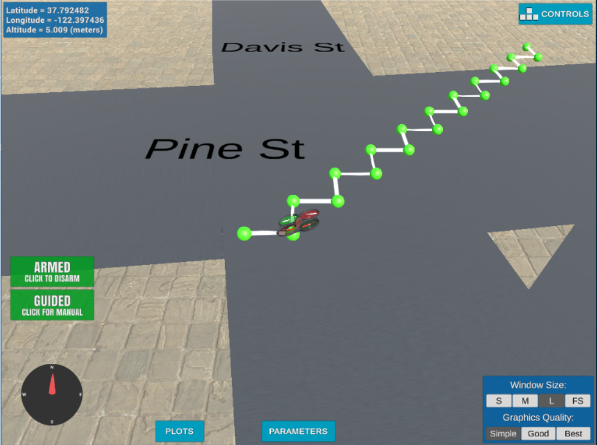
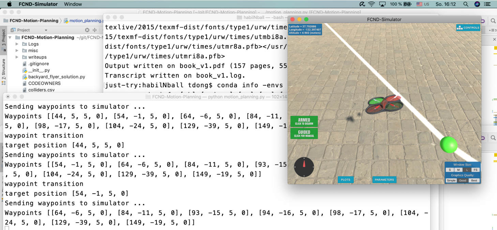

## Project: 3D Motion Planning


---


# Objective:

The objective of this project is to use the techniques explained in the 3D Motion Planning course of the Udacity Flying Car and Autonomous Flight Nanodegree program and implement a path planning algorithm.

The below mentioned sections address the details of the provided basic starter code and elaborates the different steps and code that were done to fly a drone autonomously in the Udacity Simulator as part of the project.

### Starter Code Explanation

The starter code contains two principal files viz. `motion_planning.py` and `planning_utils.py`.

The motion_planning.py is a modified version of the backyard_flyer_solution.py. 
The  modifications are as explained below,

####Details of motion_planning.py
***Addition of a new PLANNING state.***

A new PLANNING state is added for computing a 3D path along waypoints from start to goal.
The State enumeration is set to auto() values over fixed numerical values as was done in the backyard flyer.

***Modification of the state callback.***

The new PLANNING state is called once the drone is armed. This is a key distinction with respect to the backyard flyer.
We call the `self.plan_path()` for waypoints computation. Once the computation of the waypoints is done, then we takeoff the drone and follow the computed waypoints path.

***The plan_path function.***

This newly added function is used to compute the path using different 3D motion planning techniques to compute the waypoints.
The plan_path basic implementation uses a grid based solution to find a path from the start to the goal.
Its different steps are,

1. Set the drone altitude and safety distance to 5 meters.
2. Read the colliders.csv file and compute a grid based representation of the entire map.
3. Set the start to the center of the map and the goal to a location 10 meters north and 10 meters east.
4. Compute the waypoints from start to goal using A Star implementation based on grids.
5. Send the computed waypoints using `self.send_waypoints()` to the drone by using msgpack library for packing the waypoint data and then 
writing the waypoint data to the drone connection.

####Details of planning_utils.py

The planning_utils.py is a utility class with the following methods,

| Method        | Description |
| ------------- |-------------| 
| create_grid    | A method for computing a grid representation of a 2.5D configuration space for given obstacle data, drone altitude and safety distance | 
|   valid_actions    | A method to calculate a list of valid actions for a drone to navigate from a given drone grid position.      | 
| a_star | Search algorithm to return the path and path cost for a given start and goal locations of a grid.   | 
| heuristic| A method that is used by the a_star algorithm for calculating paths. The heuristic used is the Euclidean distance.|

Executing the code using `python motion_planning.py`, the drone is seen to fly in a jerky zigzag manner.



###

### Implementing the Path Planning Algorithm

The path planning algorithm is implemented using a [graph based solution](./motion_planning.py) and the default [grid based solution](./motion_planning_grid.py).

The implementation steps for graph based as well as grid based are done in the `self.plan_path` and are explained below.
#### 1. Set global home position
The global home position is provided on the first line of the colliders.csv file. 
A utility function `self.get_home_position()` is defined as follows,

```python
    def get_home_position(self):
        with open('colliders.csv') as f:
            latLongLine = f.readlines()[0]
        
        strings = latLongLine.split(', ')
    
        latitude = strings[0].split()[1]
        longitude = strings[1].split()[1]

        return float(latitude), float(longitude)
```
The global home position is read and then set 

```python
    # TODO: read lat0, lon0 from colliders into floating point values
    latitude, longitude = self.get_home_position()

    # TODO: set home position to (lon0, lat0, 0)
    self.set_home_position(longitude, latitude, 0.0)
```
#### 2. Set current local position
The current position is obtained by first getting the global position in `current_global_position` and then using a utility method `global_to_local` from `udacidrone.frame_utils`.
```python
    # TODO: retrieve current global position
    # TODO: convert to current local position using global_to_local()
    current_global_position = np.array([self._longitude, self._latitude, self._altitude])
    self._north, self._east, self._down = global_to_local(current_global_position, self.global_home)
```
#### 3. Set start position from local position
By reading the colliders.csv data the north_offset and east_offset are obtained. These are nothing but the minimum north and east values of the grid.

For [graph based solution](./motion_planning.py) and [grid based solution](./motion_planning_grid.py) the start position is set by first reading the current local position and then adding to the negative offsets.

```python
    # TODO: convert start position to current position rather than map center
    current_position = self.local_position
    start = (-north_offset + int(current_position[0]) , -east_offset + int(current_position[1]))
```
#### 4. Set goal position from geodetic coords
This step is to add flexibility to the desired goal location. The drone should be able to choose any (lat, lon) within the map and have it rendered to a goal location on the grid.
Here set the `goal_longitude` and `goal_latitude` variables to values within the map,

````python
    goal_longitude = -122.397745
    goal_latitude =  37.793837
````
Then set the goal position as,

````python
    target_location = global_to_local([goal_longitude, goal_latitude, 0], self.global_home)
    goal = (-north_offset + int(target_location[0]), -east_offset + int(target_location[1]))
````
#### 5. Modify A* to include diagonal motion (for [grid based solution](./motion_planning_grid.py))
The `planning_utils.py` is modified to include the diagonal motions `NORTH_EAST, NORTH_WEST, SOUTH_EAST, SOUTH_WEST` each having square root of 2 as cost , in the Action class.

````python
    # Diagonal Actions
    NORTH_WEST = (-1, -1, np.sqrt(2))
    NORTH_EAST = (-1, 1, np.sqrt(2))
    SOUTH_WEST = (1, -1, np.sqrt(2))
    SOUTH_EAST = (1, 1, np.sqrt(2))
````
The `valid_actions` method is then changed to also remove the new diagonal actions if the corresponding grid cells contain an obstace.

````python
    # Checks for the new diagonal actions
    if x - 1 < 0 or y + 1 > m or grid[x - 1, y + 1] == 1:
        valid_actions.remove(Action.NORTH_EAST)
    if x + 1 > n or y + 1 > m or grid[x + 1, y + 1] == 1:
        valid_actions.remove(Action.SOUTH_EAST)
    if y - 1 < 0 or x - 1 < 0 or grid[x - 1, y - 1] == 1:
        valid_actions.remove(Action.NORTH_WEST)
    if y - 1 < 0 or x + 1 > n or grid[x + 1, y - 1] == 1:
        valid_actions.remove(Action.SOUTH_WEST)
````
#### 6. New utility methods for [graph based solution](./motion_planning.py)

The default solution presented in the `motion_planning.py` is a graph based solution.
The different steps to construct the graph are 

1. Based on the colliders data, drone_altitude and safety distance get grid north and east offsets.
2. Get obstacle centers as points using the drone_altitude and safety distance criteria.
3. Create a `Voronoi` diagram structure from the obstacle centers.
4. From the ridge_vertices of the created `Voronoi` diagram, compute the edges using Bresenham method for collision avoidance.
5. Create a graph structure using `networkx` library and add all edges obtained from the previous step.

The following methods are added to the `planning_utils.py`

| Method        | Description |
| ------------- |-------------|
|create_graph(data, drone_altitude, safety_distance)| A method that creates a `networkx` graph for the given drone altitude and safety distance|
|get_obstacle_centers(data, north_offset, east_offset, drone_altitude, safety_distance)| A method that computes and returns points of obstace centers based on the drone altitude, safety distance and offsets criteria|
|get_edges(voronoi, grid)| Based on the current grid and `Voronoi` diagram ridge vertices, calculate the edges that are safe from obstaces. Uses the Bresenham as a collision avoidance algorithm.|
|create_graph_from_edges(edges)| Creates and returns a `networkx` graph structure and adds the edges.|
|a_star_graph(graph, start, goal)| A star algorithm to search the graph structure for a path and cost from start to goal|
|closest_point(graph, current_point)| For a given point, return the closest point on the graph|
#### 7. Prune waypoints 

The path waypoints are checked for collinearity using the determinant method for every set of 3 consecuive points.
For this additional utility methods are added in the `planning_utils.py`

| Method        | Description |
| ------------- |-------------|
|collinearity_check(p1, p2, p3, epsilon=1e-6)| Checks the collinearity using the determinant or area of triangle method for 3 points and a give threshold epsilon|
|prune_path(path)| Prunes the path using the collinearity checks to cull collinear waypoints|

The `prune_path` method is used by the graph based and grid based solutions.

### Execute the flight
#### 1. Does it work?

Here is a capture of the solution.


### Double check that you've met specifications for each of the [rubric](https://review.udacity.com/#!/rubrics/1534/view) points.
  
# Extra Challenges: Real World Planning

For an extra challenge, consider implementing some of the techniques described in the "Real World Planning" lesson. You could try implementing a vehicle model to take dynamic constraints into account, or implement a replanning method to invoke if you get off course or encounter unexpected obstacles.

I will surely do this later :)

